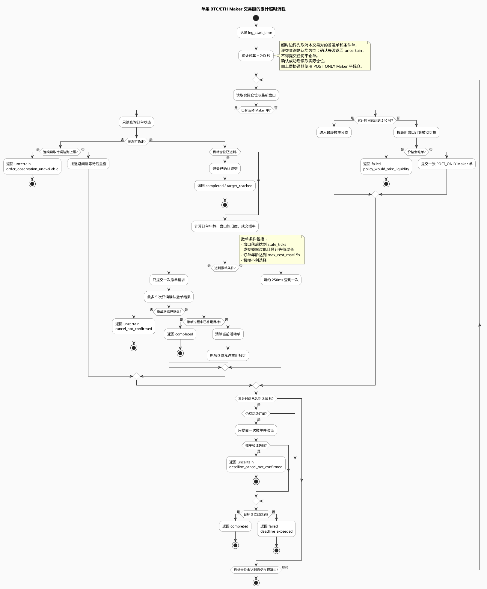
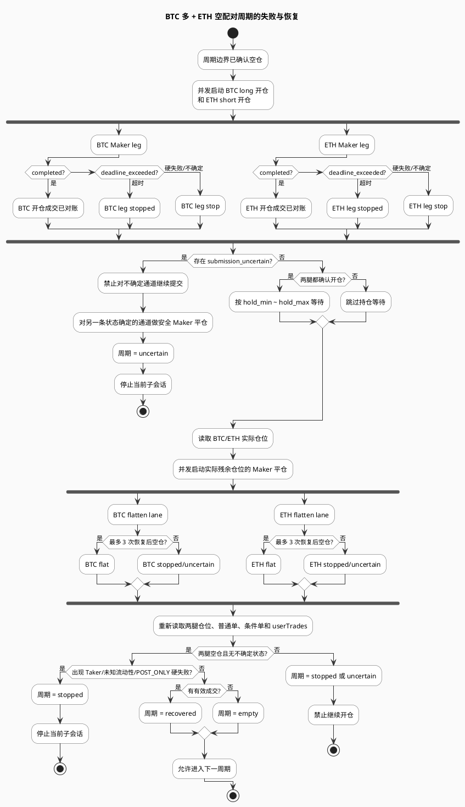
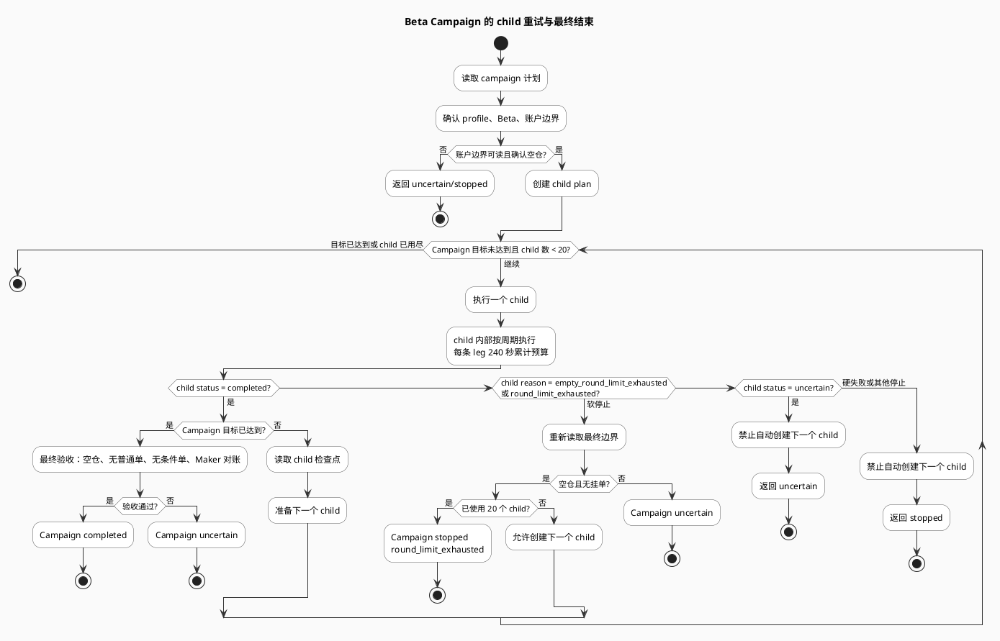

# Beta Maker 超时与失败判定流程

本文说明当前 `live beta-volume` 和 `live beta-campaign` 在时间耗尽、连续无成交、部分成交、撤单确认失败等情况下的实际行为。

> 本文描述的是当前实现，不是交易所保证。所有成交、撤单和最终空仓状态都必须经过 WEEX 权威接口确认。

## 先看结论

`240 秒`是**单条交易腿的一次执行调用的累计总时限**。它从该腿开始执行时计时，覆盖：

- Maker 挂单前的盘口读取和限频等待；
- 当前挂单的成交轮询；
- 重新报价前的撤单和撤单确认；
- 每次重新报价后的等待。

它不是每张订单各自拥有的 240 秒，也不会因为部分成交或重新报价而重置。

| 层级 | 时间/次数边界 | 到达边界后的行为 |
| --- | --- | --- |
| 单张 Maker 订单 | 通常最多驻留 15 秒；盘口恶化时可在满 3 秒后提前撤 | 撤单一次，验证撤单结果；确认后才允许重新报价 |
| 单条交易腿 | 累计 240 秒 | 取消该交易对的普通单和条件单并逐类确认为空；确认成功后才能进入残仓 Maker 平仓；未完成则返回 `deadline_exceeded` |
| 撤单/清理确认 | 最多 5 次只读查询，间隔约 0.25、0.5、1、2 秒 | 单笔撤单或全量清理仍无法确认则分别返回 `deadline_cancel_not_confirmed` / `deadline_cleanup_not_confirmed`，进入不确定状态 |
| 单个 Beta 周期 | BTC/ETH 开仓、必要的 Maker 恢复平仓、最终空仓检查 | 空仓且无硬失败/不确定时可标记 `recovered` 并继续 |
| Beta 子会话 | 默认允许连续 3 个空周期 | 第 4 个空周期触发 `empty_round_limit_exhausted` |
| Beta Campaign | 最多 20 个有界 child session | 只对明确允许的软停止创建下一个 child；不确定或硬失败直接结束 |

## 失败分类

### 1. 可恢复的超时

单腿到达 240 秒后，如果满足以下条件，超时可以被周期级恢复：

1. 最后一张挂单已确认撤销，或已确认在撤单过程中成交；
2. 实际残余仓位可以读取；
3. 残余仓位通过纯 Maker 平仓；
4. BTC 和 ETH 最终都确认空仓；
5. 成交明细对账成功，且全部为 Maker。

此时周期状态是 `recovered`。它不是成功完成了原计划量，而是安全收敛到空仓，之后可以开始下一个周期。

### 2. 当前周期停止，但 Campaign 可能换 child

如果周期已经回到空仓，但该周期没有产生有效成交，或者达到了允许的空周期/轮次上限，子会话可能返回：

- `empty_round_limit_exhausted`
- `round_limit_exhausted`

这两个原因属于 Campaign 允许重试的软停止。Campaign 会重新读取空仓边界，创建下一个有界 child；最多受 `max_runs=20` 限制，不会无限循环。

### 3. 直接硬失败

下列情况不会通过“再等一会儿”解决，也不会降级为 GTC、市价单或追价：

- `post_only_rejected`
- `taker_fill_detected`
- `unknown_liquidity`
- `venue_did_not_accept_post_only`
- `policy_would_take_liquidity`
- `target_overfilled`

一旦出现这些结果，当前周期停止；Campaign 不会因为还有剩余目标量而继续提交新单。

### 4. 不确定失败

下列情况意味着程序无法证明真实状态，必须停止提交：

- `order_observation_unavailable`
- `cancel_not_confirmed`
- `deadline_cancel_not_confirmed`
- `deadline_cleanup_not_confirmed`
- `deadline_order_not_confirmed`
- `submission_uncertain`
- `active_order_remains_after_leg`
- `position_observation_unavailable`
- 成交明细无法对账或 Maker 属性无法确认

不确定不是“没成交”，而是“不能安全判断有没有成交”。这时程序会返回 `uncertain`，需要重新读取真实账户状态后，使用显式恢复流程处理，绝不自动重提同一意图。

## 单条交易腿：240 秒时序



## 一个周期：开仓失败后如何收敛

BTC 多仓和 ETH 空仓使用两个独立通道并发执行。开仓阶段结束后，不论一条腿成功、一条腿超时，还是两条腿都部分成交，主线程都会读取实际仓位，再决定需要哪些平仓任务。



## Campaign 层：什么时候继续，什么时候结束

`live beta-campaign` 不是把一个 240 秒预算无限延长，而是最多创建 20 个有界 child。每个 child 都从已确认空仓边界开始，并在结束时再次检查空仓和挂单。



## “连续 6 次失败”到底对应什么

这个说法可能对应三种不同计数，程序行为不同：

### 连续 6 次重新报价

不会因为第 6 次就直接失败。重新报价最多受两道边界限制：

- 单腿累计 240 秒；
- `max_requotes=30`。

实际通常是 240 秒先到，因为每次重新报价还要消耗撤单确认和重新挂单时间。

### 连续 6 个空周期

默认 `max_empty_rounds=3`，所以同一个 child 不会等到第 6 个空周期：

```text
第 1 个空周期：继续
第 2 个空周期：继续
第 3 个空周期：继续
第 4 个空周期：停止当前 child
```

如果这是 Campaign 而不是单独的 `beta-volume`，并且第 4 个空周期结束时已经确认空仓，Campaign 可以把这个软停止转换为下一个 child；但总 child 数仍不超过 20。

### 连续 6 次提交都没有成交

程序不会单纯按“提交次数”判断安全。它会在每次提交后观察：

- 当前订单状态是否可读；
- 是否有部分成交；
- Maker/Taker 属性是否明确；
- 撤单是否确认；
- 实际仓位是否与成交明细一致。

因此即使只提交了 2 次，只要第二次撤单状态不确定，也会立即进入 `uncertain`；反过来，即使提交了 6 次，只要在 240 秒内都被明确撤销、最终实际仓位被 Maker 平掉，也可能只是一次 `recovered` 周期。

## 代码对应关系

- 单腿累计 deadline、最终撤单和 `deadline_exceeded`：[`adaptive_executor.py`](../../src/weex_cli/adaptive_executor.py)
- Maker 订单的最短/最长驻留与盘口决策：[`adaptive_maker.py`](../../src/weex_cli/adaptive_maker.py)
- BTC/ETH 并发开仓、实际仓位平仓与周期判定：[`beta_volume.py`](../../src/weex_cli/beta_volume.py)
- Campaign child 的软停止重试与不确定状态终止：[`beta_campaign.py`](../../src/weex_cli/beta_campaign.py)
